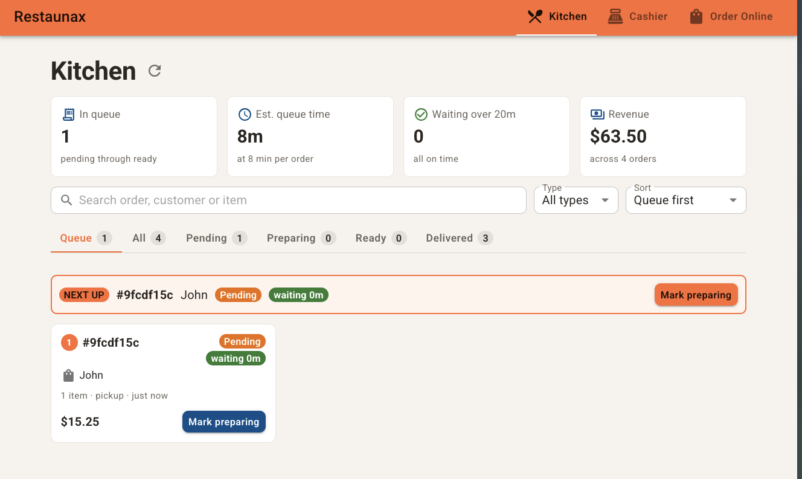
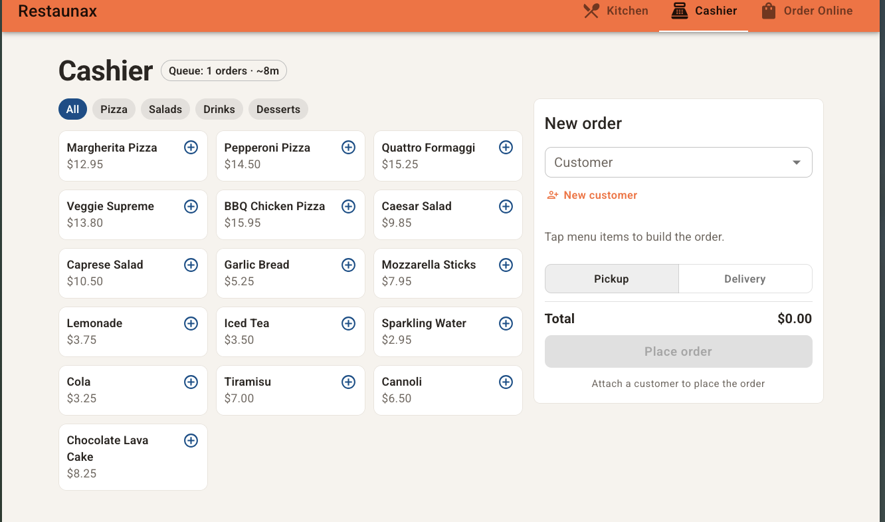
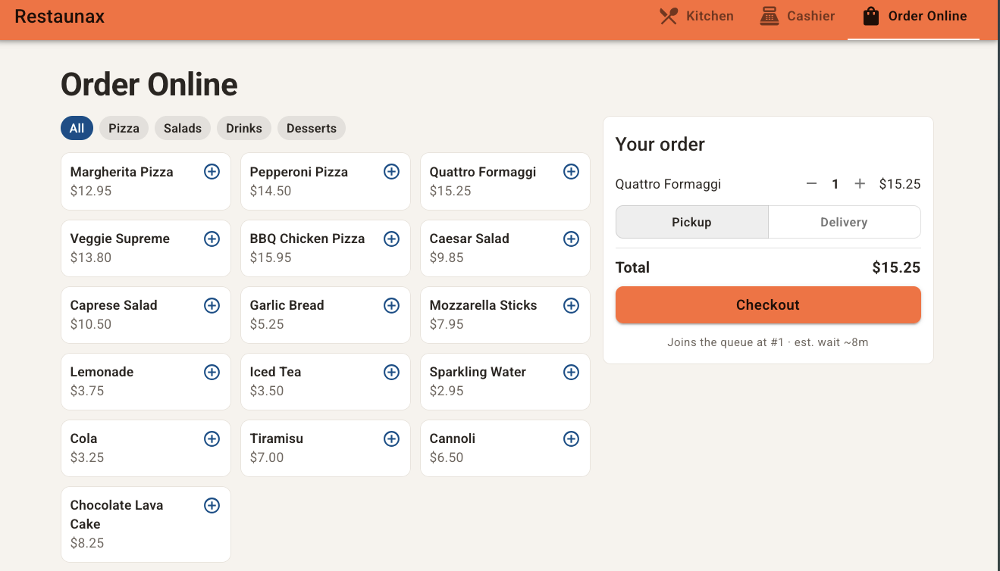
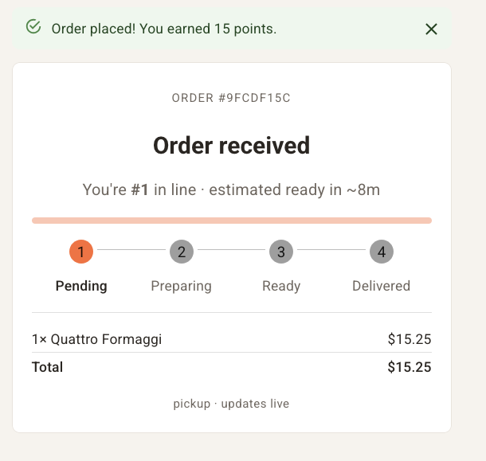

# Restaunax Full-Stack Developer

This project showcases a restaurant dashboard, along with a cashier view and an online ordering system. The main point of this system is to prioritize orders being delivered in a timely manner, with real-time updates for orders. You can view this project on the following website: 
[resta.zuriel.dev](https://resta.zuriel.dev/)

## Screenshots







## **Setup Instructions**

### Local Dev Environment Steps

1. Install all dependencies for both backend and front-end

```bash
# Terminal 1 - Run backend (from /backend directory)
cd ./backend
npm install

# Terminal 2 - Run frontend (from /frontend directory)
cd ./frontend
npm install
```

2. In the backend folder, copy the environment example '.env.example' file to make a to make the environment file '.env'

```bash
cd ./backend
cp .env.example .env
```

3. Let's start up the Docker Compose file for Postgres

```bash
cd ./backend
docker compose -f docker-compose.postgress.dev.yml up
```

4. Now let's start up the development server for the back end and the front end

```bash
# Terminal 1 - Run backend (from /backend directory)
cd ./backend
npm run dev

# Terminal 2 - Run frontend (from /frontend directory)
cd ./frontend
npm run dev
```

5. Open in your browser localhost port 3000 and localhost port 5173. And you should be able to use the application

backend: http://localhost:3000

frontend: http://localhost:5173

### Production Environment Steps

1. First we are going to copy the environment variables example file to create the environment file

```bash
cp .env.example .env
```

In the environment file you can change the following:
* Postgres user 
* Password has to be changed to a more secure one 
* DB name 

This is where you would add your domain name for your frontend and your domain name for your API/backend. 

You can also switch up the ports if you need to

```yml
POSTGRES_USER=admin
POSTGRES_PASSWORD=change-me
POSTGRES_DB=restaunax
CLIENT_ORIGIN=https://example.com
VITE_API_URL=https://api.example.com
BACKEND_PORT=3000 
FRONTEND_PORT=5173
```

## **Implementation Notes**

The first thing I did was read through the backend starter code in order to get a better understanding of what I was working with. Once I looked at it, I separated the customer data from orders, because embedding the customer inside every order meant resending the same information again and again. I knew I wanted to use Postgres and Prisma, therefore I went and set that up, which then brought up the issue of having to sanitize the old mock data in order for it to be seeded into the database. Some of the mock data had incorrect calculations or missing parts, therefore I also validated the data to make sure everything was correct. Since I had separated customers from orders, another thing I had to do was create a new API endpoint for customers, and that was the end of the backend development for now.

Soon after, I started to think about the UI and what would be a useful dashboard for a restaurant owner. I had to put myself in the shoes of the restaurant owner and think about what would be the best system for me if I ran a restaurant. I thought, well, I don't want to make customers wait too long, therefore I decided to create a queue system as the default view, which is first come, first serve, in order to ensure that customers are never waiting too long for their food. I also thought about creating different views based on the daily needs of a restaurant. Of course you need a view for the kitchen to see all the orders, a cashier view for when they have to take orders in person, and then an online view for mobile or online orders. The final thing I wanted was a tracking system for the orders, which I used Socket.IO for in order to have real-time updates. I did this so customers know exactly where their order is in the process. Although, thinking back on it, I don't know if restaurants would have time to manually click an order from start to finish. I feel like they might be too busy making the food to be actively updating statuses, however I still think it's a nice feature to have.

Finally, I containerized the whole stack with Docker Compose, meaning Postgres, the backend, and the frontend, in order to deploy it to my VPS with a single command.


## **Design Decisions**

My first main decision was how to show the orders on the kitchen dashboard, therefore I created a first come, first serve queue system. I made this in order to prioritize older orders so customers are not waiting too long. This ensures that orders are delivered in a reasonable time and keeps customers happy, because forgetting a customer's order could make them mad and you could potentially lose that customer.

One of the early decisions I had to make was how I was going to handle routing, because I knew I wanted different views. I thought about using React Router, however it felt overkill for four routes, therefore I decided on a simple hash router instead. This keeps things simple and also means fewer dependencies on the project.

When I was creating the cashier system, I had to think about how I was going to get the menu. I thought about just getting the menu straight from the database items. However, as soon as I read the database structure, I noticed that menu item names are not unique, therefore there could be multiple rows of something like chicken wings with nothing connecting them. The next step would have been to create a menu table and assign items to it, however I soon realized this would have taken too long and I think it's out of scope for this project. Therefore, in order to keep the project in scope and not delay the work, I decided to create a predefined menu in the code instead of one in the database.

I decided to add the point system into the checkout process. I did this in order to make the points useful, since they were already sitting on the mock data doing nothing. Basically, 1,000 points redeem to one dollar off, whereas every dollar spent earns one point back. The only thing I am unsure of is whether my conversion rate is well balanced, since I have never designed a point system before, therefore I picked something simple and conservative.

I wanted a real time update and for this I used Socket.IO. I thought about the situations where real-time would actually be useful. One of these, of course, was tracking your order. The other was for the restaurant itself, since I now have two staff views, a kitchen view and a cashier view. For example, someone orders something and goes up to the cashier to ask how long their order will take. If the cashier's screen doesn't update in real time, then they will have outdated data and won't be able to give a correct answer to the customer, which could cause issues. I think this is a simple example of why the restaurant side needs real-time too. Therefore I created one WebSocket subscription for all orders and one by ID for the order tracking.


## **Challenges**

I think my first challenge was adjusting to how the code was structured, because I have been using Convex for most of my projects lately and I haven't had a need for a separate backend and frontend file system. Thankfully I was able to quickly adjust to it again. It was good to see an example like this, because it reminded me to always ensure my backend and frontend are properly separate, and it helped me understand what a proper structure should look like.

Another challenge was dealing with the menu system. Like I said, I originally thought about getting the menu items from the database, however I quickly realized how much would have to change in both the database and my code. Therefore I went to my next plan, which was basically hardcoding a menu system into the codebase. The interesting part wasn't the solution itself, it was catching the problem early enough to make a calm decision instead of a rushed one.

The last major challenge was deploying this on my VPS. Currently I use Dokploy, which makes it easier to deploy, however it still had a bunch of issues. I first ran into CORS errors. This was mainly because I had a two-level subdomain for the API, therefore I changed it to a single subdomain, which solved the CORS issue. Next I had an ERR_BLOCKED_BY_CLIENT error, which happened because I forgot to enable the isolated environment on Dokploy, which is basically what allows the containers to talk to each other. I originally thought it was a port issue, therefore I changed the ports and completely broke production. I then reverted back and was able to fix the real issue by, of course, enabling the isolated environment. Breaking production taught me to diagnose first and change one thing at a time.

# **Additional Features** 

I think real time order tracking is very important to have, because a customer should always know where their order is so they can arrive at the proper time. In my personal experience it is a bit frustrating when you're hungry, you arrive at the restaurant, and the food is not ready. It has happened to me a couple of times and I just had to wait there. Therefore I think having a proper time estimate keeps customers happy, whereas without it they end up waiting extra at the restaurant when they could have just chilled a bit more at home and then gone to pick up the food.

I decided to go a bit simple on analytics. I show how much the restaurant has made across all orders, how many orders are in the queue, how many orders need attention, and an estimate of how long a new order would take. This is mainly in order to keep track of how well we are doing on orders, or how behind we are. You always want to make sure that the attention number stays low, because in a restaurant you can be dealing with hangry customers, therefore managing your time well matters a lot.

I added a search feature where you can easily look up customers, items, or anything searchable within the orders. This was mainly to help the restaurant owner find information quickly. Let's say a certain customer comes in asking about their order and you have a lot of orders on screen. You can't just scroll down and look for it, whereas with search you just type the customer's name and you know exactly where they are in line.

I believe a queue system and a wait timer is my best implementation. As a restaurant you always want to make sure you deliver food in a timely manner, and with this you ensure the customer that came first always gets priority on getting their order finished. I also added a wait timer on each order so you know exactly how long a customer has been waiting for their food, and it escalates visually when it's been too long. The main focus of these two implementations together is to ensure food comes out on time and no order ever gets forgotten.


---


### Restaunax Full-Stack Developer Technical Assessment

Welcome to the Restaunax Technical Assessment! 🍕🚀

Thank you for your interest in joining our team at Restaunax. This assessment is designed to evaluate your essential full-stack development skills within the context of our restaurant management platform.

We've provided starter code to help you focus on implementing functionality rather than configuration. Take the time you need to showcase your skills.

---

## 🚀 Getting Started

### 1. Clone and Setup

```bash
# Clone this repository
git clone https://github.com/Restaunax/restaunax-technical-assessment.git
cd restaunax-technical-assessment

# Install backend dependencies
cd backend
npm install

# Install frontend dependencies
cd ../frontend
npm install
```

### 2. Run the Application

```bash
# Terminal 1 - Run backend (from /backend directory)
npm run dev

# Terminal 2 - Run frontend (from /frontend directory)
npm run dev
```

The backend will run on `http://localhost:3000` and frontend on `http://localhost:5173`.

## 📋 The Scenario

As a developer at Restaunax, you'll be working on our restaurant management system. Your task is to implement a **Real-time Order Management Dashboard** that allows restaurant owners to view and update orders.

## ✅ Technical Requirements

**Required:**

- ✅ **TypeScript** (strict mode) for both frontend and backend
- ✅ **React** with **Material-UI** components
- ✅ **Node.js/Express** backend
- ✅ Type-safe API contracts between frontend and backend

**Data Storage (Choose One):**

- **Highly Recommended**: PostgreSQL with Prisma running in a Docker container (demonstrates production-ready skills)
- Use the provided `mockOrders.ts` file (simplest approach, acceptable)
- In-memory data structure
- JSON file storage
- SQLite

**Note:** While we've provided mock data for quick setup, we highly value candidates who can set up a proper database with Prisma and Docker. This demonstrates real-world full-stack capabilities.

## 🎯 Your Task

### 1. Backend API

Implement endpoints in `backend/src/routes/orders.ts`. At minimum, you should implement:

**Core Requirements:**
- `GET /api/orders` — List all orders (with optional status filtering via query params)
- `GET /api/orders/:id` — Retrieve a specific order by ID

**Optional (Recommended):**
- `PATCH /api/orders/:id` — Update order status
- `POST /api/orders` — Create a new order

Feel free to add additional endpoints or functionality that you think would be useful for an order management system.

**Order Schema** (already defined in `shared/types.ts`):

| Field                | Type                                               |
| -------------------- | -------------------------------------------------- |
| id                   | string                                             |
| customerName         | string                                             |
| customerEmail        | string                                             |
| customerPhone        | string                                             |
| customerRewardPoints | number                                             |
| orderType            | "delivery" \| "pickup"                             |
| items                | OrderItem[]                                        |
| status               | "pending" \| "preparing" \| "ready" \| "delivered" |
| total                | number                                             |
| createdAt            | string (ISO format)                                |

> **💡 Data Modeling Challenge**: Notice how customer information is embedded in each order? Consider whether this is the best approach for a real-world application. How might you improve this data structure?

**Order Item Schema:**

| Field    | Type   |
| -------- | ------ |
| id       | string |
| name     | string |
| quantity | number |
| price    | number |

### 2. Frontend UI

Build a dashboard in `frontend/src/` using **React and Material-UI**. At minimum, your UI should:

**Core Requirements:**
- Display a list of orders with relevant information
- Filter or group orders by status
- Show loading and error states appropriately
- Use Material-UI components

**Get Creative:**
- Design the layout however you think works best
- Add any additional features you think would enhance the user experience
- Show us your UI/UX sensibilities
- If you implemented PATCH for status updates, add UI controls for it

### 3. Integration

- Connect your frontend to the backend API
- Ensure type safety between frontend and backend using shared types
- Handle errors appropriately (network failures, invalid data, etc.)

## 🎨 What We're Looking For

| Area                  | What We Value                                       |
| --------------------- | --------------------------------------------------- |
| **TypeScript Usage**  | Proper typing, no `any`, leveraging type inference  |
| **Code Organization** | Clean folder structure, separation of concerns      |
| **UI Implementation** | Proper use of Material-UI components                |
| **User Experience**   | Intuitive, functional, responsive interface         |
| **API Design**        | RESTful patterns, proper HTTP methods and responses |
| **Error Handling**    | Graceful handling of common errors                  |
| **Code Quality**      | Readable, maintainable code with consistent style   |

## 🌟 Bonus Ideas (Optional)

**If you've completed the core requirements and want to showcase additional skills:**

- 🐳 **Docker**: Containerize the application with docker-compose
- 📊 **Analytics**: Add order statistics or dashboard visualizations
- 🔄 **Real-time Updates**: Implement WebSocket updates with Socket.IO
- 🎨 **UX Polish**: Add animations, transitions, or advanced interactions
- 🧪 **Testing**: Add unit or integration tests
- 🔍 **Search/Filters**: Advanced filtering or search functionality
- 📱 **Mobile-First**: Exceptional mobile responsiveness
- ♿ **Accessibility**: ARIA labels and keyboard navigation
- 🎯 **Your Idea**: Surprise us with something creative!

**Note:** A solid, clean implementation of core features is more valuable than rushed bonus features.

## 📦 What's Included

This starter repository includes:

```
restaunax-technical-assessment/
├── backend/
│   ├── src/
│   │   ├── index.ts              # Express server setup
│   │   ├── routes/
│   │   │   └── orders.ts         # TODO: Implement your endpoints here
│   │   └── data/
│   │       └── mockOrders.ts     # Sample data (15 orders)
│   ├── package.json
│   └── tsconfig.json
├── frontend/
│   ├── src/
│   │   ├── App.tsx               # TODO: Build your UI here
│   │   ├── main.tsx
│   │   └── services/
│   │       └── api.ts            # TODO: Add API calls here
│   ├── package.json
│   ├── tsconfig.json
│   └── vite.config.ts
└── shared/
    └── types.ts                  # Shared TypeScript types
```

## 📤 Submission Instructions

### 1. Push to Your Own Repository

```bash
# Remove the original remote
git remote remove origin

# Create a new repository on your GitHub account restaunax-assessment
# Then add it as your remote
git remote add origin https://github.com/YOUR_USERNAME/restaunax-assessment.git

# Commit your changes
git add .
git commit -m "Complete Restaunax technical assessment"

# Push to your repository
git push -u origin main
```

### 2. Update the README

Add a section to this README with:

1. **Setup Instructions**: Clear steps to run your application
2. **Implementation Notes**: Brief overview of your approach and architecture decisions
3. **Design Decisions**: Explain key technical choices you made and why
4. **Challenges**: Any interesting problems you solved or obstacles you encountered
5. **Additional Features**: If you implemented bonus features or went beyond requirements, explain what and why

### 3. Share Your Repository

- Make sure your repository is **public** or invite `@Restaunax` as a collaborator
- Send us the link to your repository
- Ensure all your code is committed and pushed

### 4. What NOT to Include

- ❌ `node_modules/` folders (should be in .gitignore)
- ❌ Environment files with secrets
- ❌ Build artifacts (`dist/`, `build/`)
- ❌ IDE-specific files (`.vscode/`, `.idea/`)

## 💡 Tips for Success

1. **Start Simple**: Get the core GET endpoints working first, then build from there
2. **Use the Mock Data**: The provided mock data is ready to use - no need to set up a database unless you want to
3. **Type Safety First**: Leverage the shared types between frontend and backend
4. **Material-UI Docs**: Check out [MUI documentation](https://mui.com/) - their components are powerful
5. **Be Creative**: Show us your design sensibilities and problem-solving approach
6. **Test Your Work**: Make sure your implementation works end-to-end before submitting
7. **Document Decisions**: Explain your thought process - we want to understand how you think

## 🔧 Common Issues & Troubleshooting

**Port already in use?**
- Backend: Change port in `backend/src/index.ts`
- Frontend: Change port in `frontend/vite.config.ts`

**TypeScript errors?**
- Make sure you're importing types from `../../shared/types`
- Run `npm install` in both directories
- Check that you're using Node.js 18+

**Can't connect to API?**
- Check backend is running on port 3000
- Verify CORS is enabled (already configured)
- Check browser console for errors

**Build errors?**
- Delete `node_modules` and `package-lock.json`, then run `npm install` again
- Make sure both frontend and backend are using compatible TypeScript versions

## 📁 Project Structure

```
.
├── backend/
│   ├── src/
│   │   ├── index.ts              ✅ Express server configured
│   │   ├── routes/orders.ts      🔨 IMPLEMENT THIS
│   │   └── data/mockOrders.ts    ✅ 15 sample orders ready
│   └── package.json              ✅ Dependencies configured
├── frontend/
│   ├── src/
│   │   ├── App.tsx               🔨 BUILD YOUR UI HERE
│   │   ├── main.tsx              ✅ React + MUI configured
│   │   └── services/api.ts       🔨 ADD API CALLS HERE
│   └── package.json              ✅ Dependencies configured
└── shared/
    └── types.ts                  ✅ Shared types for both ends
```

**Legend:**
- ✅ Ready to use (no changes needed)
- 🔨 Implement your solution here

## ❓ Questions?

If you have questions about the requirements, feel free to:

- Make reasonable assumptions and document them in your README
- Implement what makes sense based on your interpretation
- Explain your decision-making process in your submission

---

Good luck! We're excited to see what you build. 🚀

**Remember**: We value clean, working code over fancy features. Focus on the fundamentals, and show us how you think and code.
